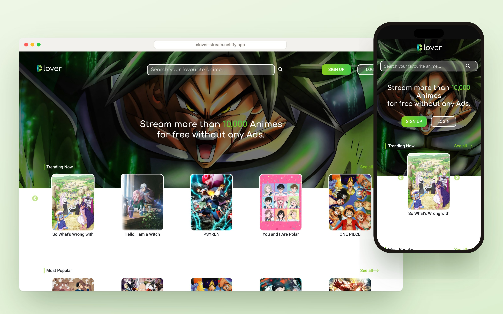
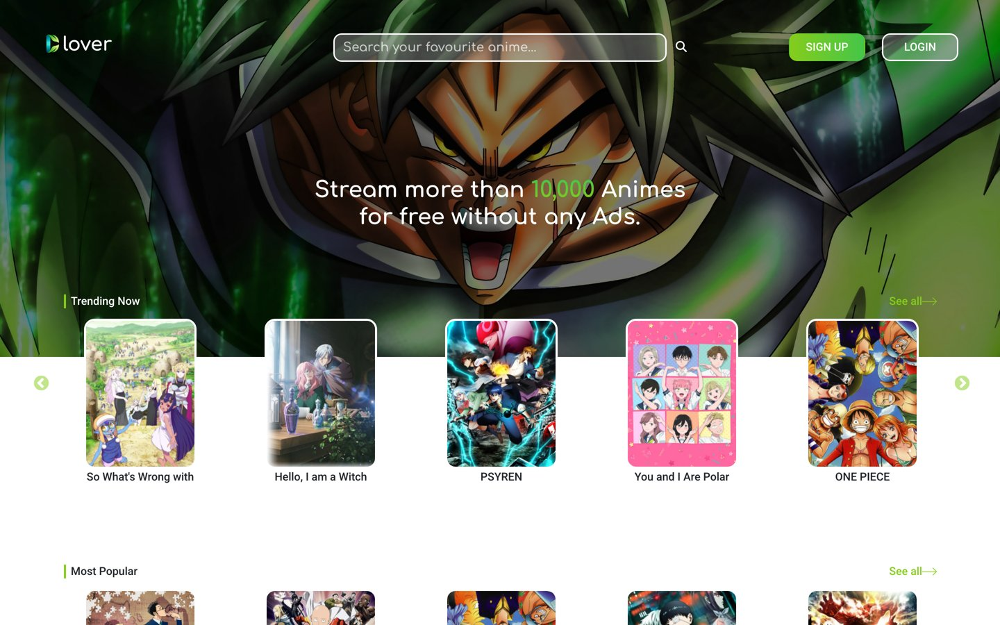
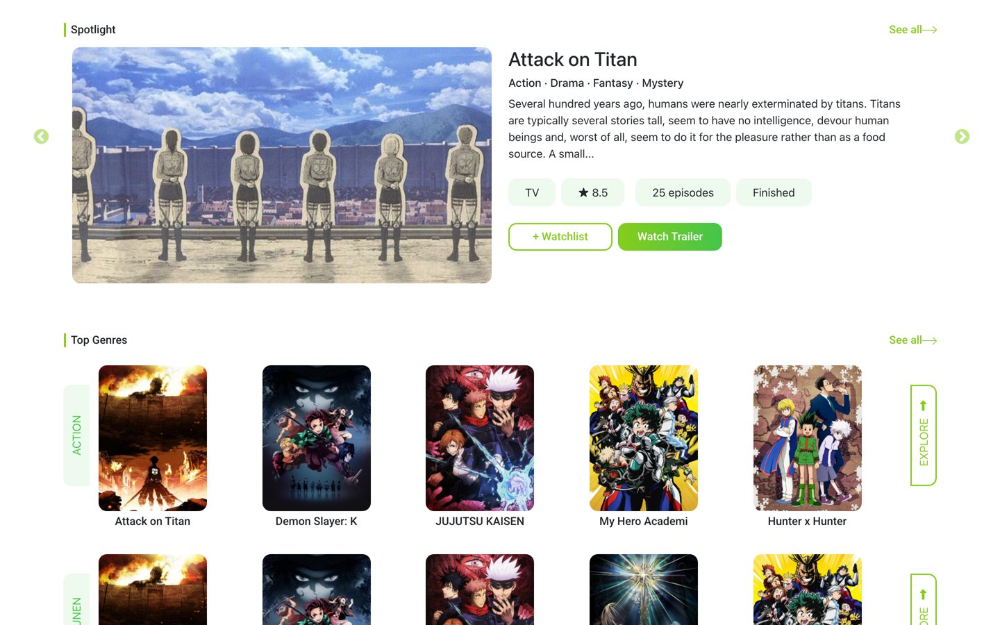
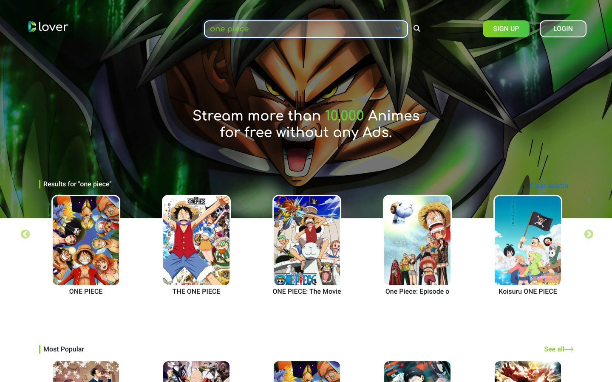
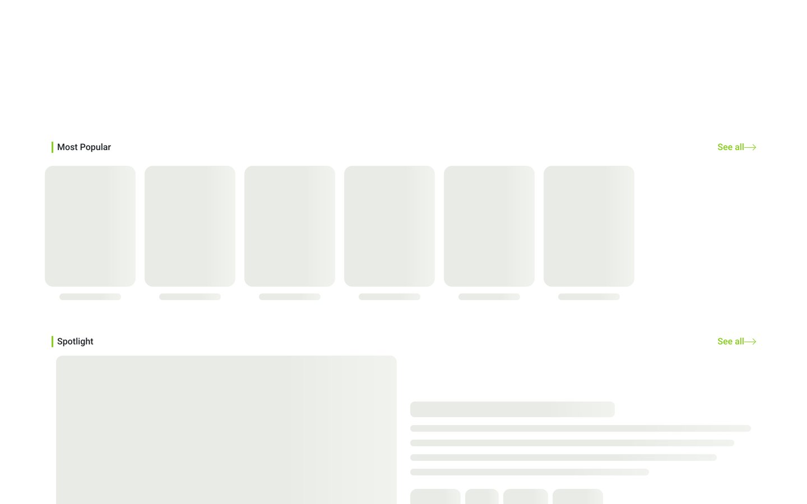
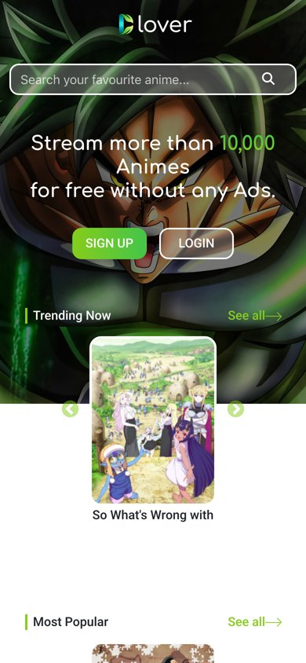

# Clover

An anime discovery web app built with React. Browse trending and popular anime, explore genres, search titles and sign in to your own account.

**[Live demo](https://clover-stream.netlify.app)**



## Features

- Trending, most popular and spotlight sections from the free [AniList API](https://anilist.co), shown in carousels
- Search by title on desktop and mobile, plus genre rows (Action, Shounen, Comedy) with "Load More" for more genres
- Sign up and log in with a JWT token stored on the client
- Profile menu and logout once you're signed in
- Skeleton loaders, error states with retry, and a responsive layout

## Screenshots

| Home | Spotlight and genres |
|---|---|
|  |  |

| Search | Skeleton loaders |
|---|---|
|  |  |



## Tech stack

React · React Router · Context API with useReducer · React Slick · AniList GraphQL API · JWT auth

The auth backend (Node.js, Express, MongoDB) lives in a separate repo.

## Project structure

```
src/
├── components/
│   ├── auth/        # Login, Signup
│   ├── Context.js   # global state, AniList requests, rate-limit queue
│   ├── Skeleton.js  # skeleton loaders and error rows
│   ├── Header.js    # nav, search, profile menu
│   ├── Carousel.js
│   └── ...          # item cards, buttons, footer, spinner
└── App.js           # routes: /, /login, /register
```

## Run locally

```bash
npm install
npm start
```

To use login, create a `.env` file pointing to the backend login endpoint:

```
REACT_APP_LOGIN=<login-endpoint-url>
```
